
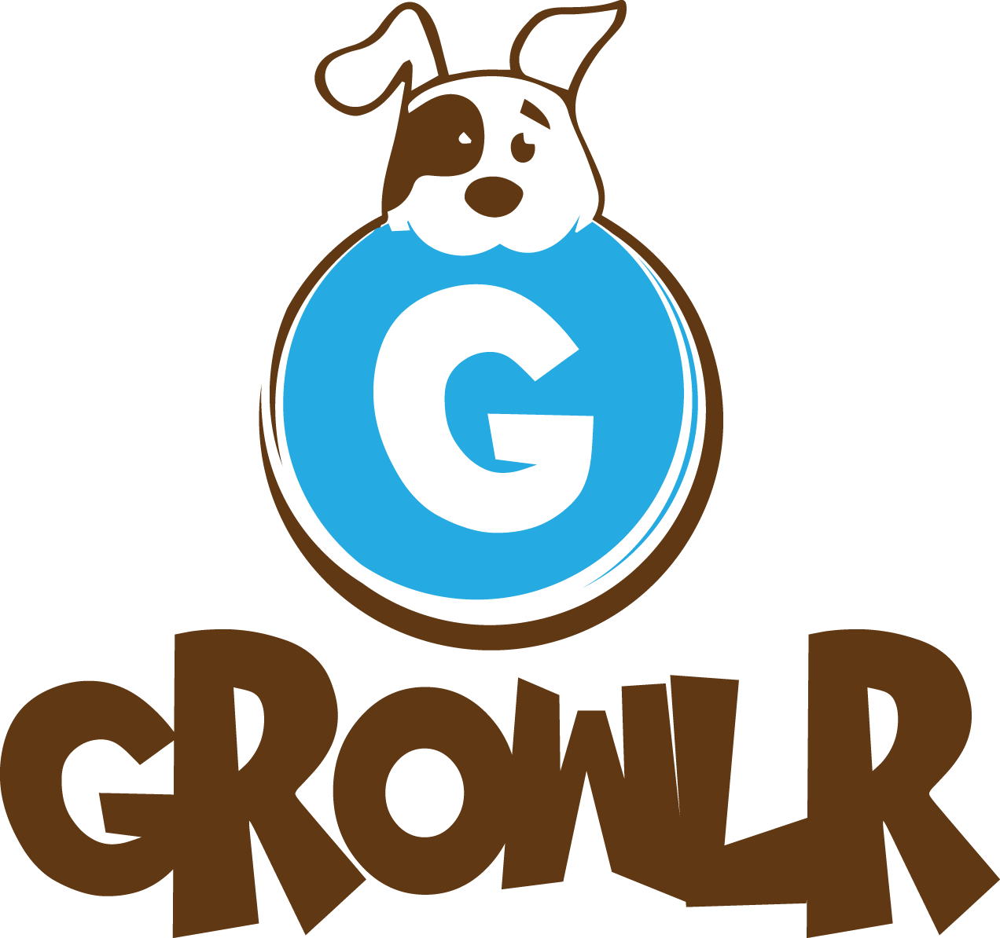

Countless dogs are returned to shelters everyday–usually due to contradicting personalities. For example: The Siberian husky is one of the most re-homed dogs because people often don’t realize how energetic they are, and how often their required to be walked. 
When a dog is re-homed, this can effect their mental heath, which can cause behavioral issues, like separation anxiety.

<h1 class="code-line" data-line-start=5 data-line-end=6 >How Can Growlr Help?</h1>

This program is designed to match you with a breed, based on your life details and personality traits. The program then shows you adoptable dogs in your area, that match your criteria, using the Petfinder API.

<h1 class="code-line" data-line-start=9 data-line-end=10 >Kiosk</h1>

Using a 7&quot; touch screen, a recycled dog house, and a nifty painting job, the Growlr Kiosk is designed to catch a users attention, enticing them to walk up to the kiosk, and find their match.

Here’s the dog house originally. It was purchased online, on Facebook Marketplace.

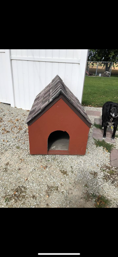

We then basically just sawed a 1/4 of it off.

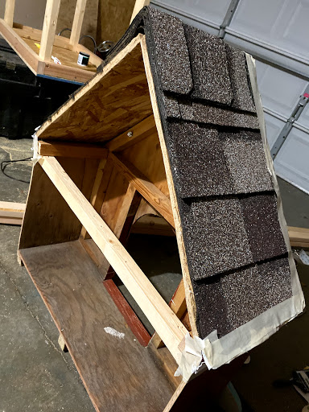

And then came the paint!

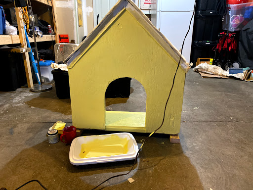

We created a cart to rest the house on. The cart puts the kiosk at a perfect level for human use. The wheels allow for easy transportation. The synthetic grass adds an environment.

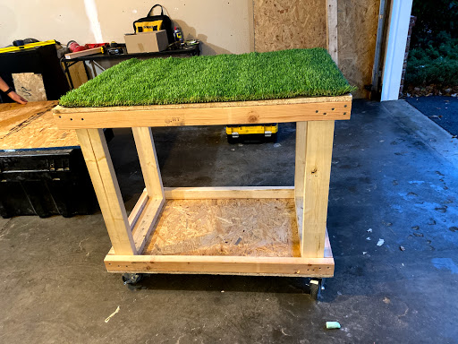

Crafting the sign.

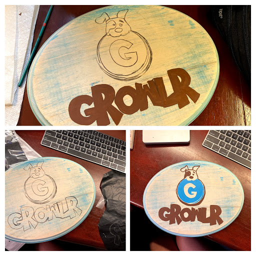

Adding some flair.

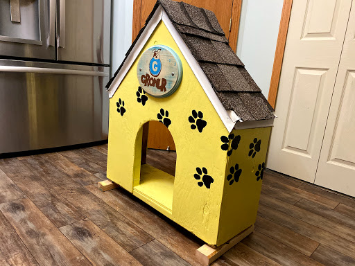

Finally, the screen was added, some dog accessories and a key pad for the user to enter in their zip code.

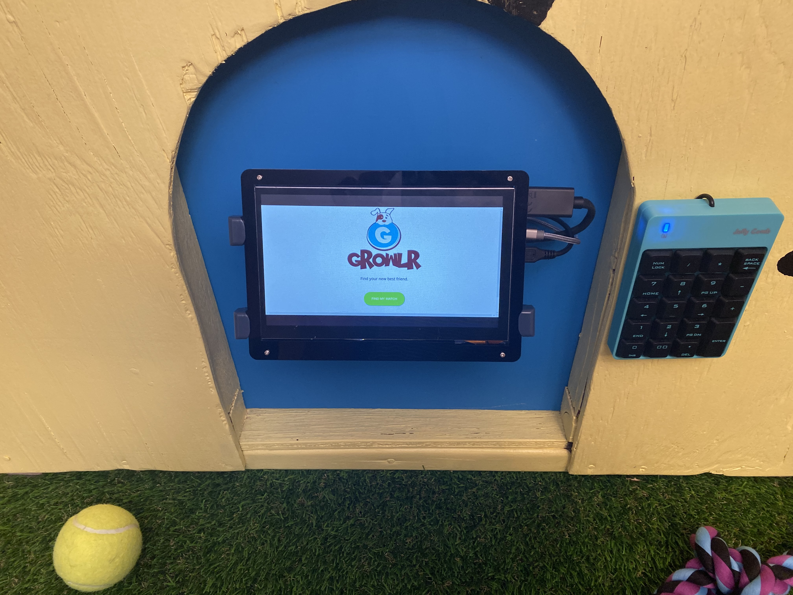

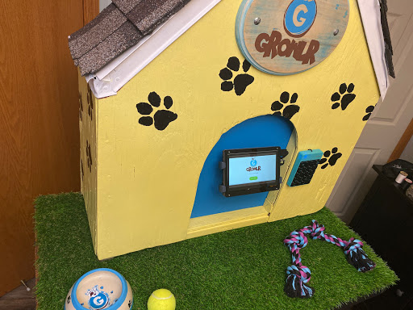

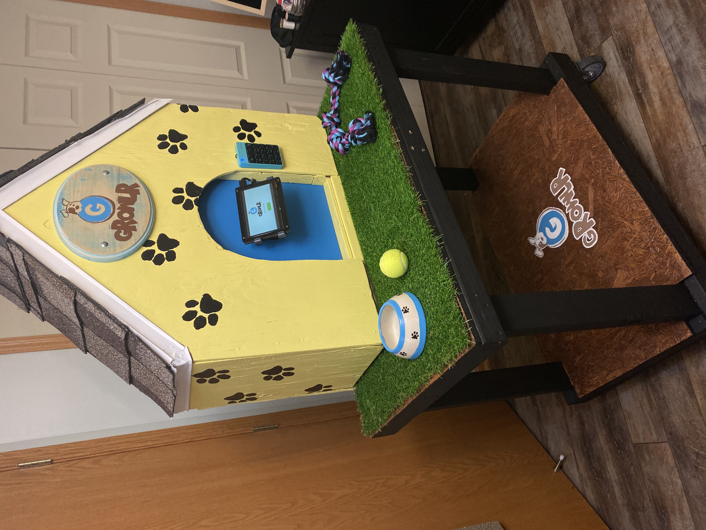

<h1 class="code-line" data-line-start=45 data-line-end=46 >Coding</h1>

<strong>Languages and Tools Used:</strong>

<ul>
<li class="has-line-data" data-line-start="47" data-line-end="48">ASP .NET</li>
<li class="has-line-data" data-line-start="48" data-line-end="49">C#</li>
<li class="has-line-data" data-line-start="49" data-line-end="50">HTML</li>
<li class="has-line-data" data-line-start="50" data-line-end="51">CSS</li>
<li class="has-line-data" data-line-start="51" data-line-end="52">JavaScript</li>
<li class="has-line-data" data-line-start="52" data-line-end="53">MS SQL</li>
<li class="has-line-data" data-line-start="53" data-line-end="54"><a href="https://www.petfinder.com/developers/api-docs">Petfinder API</a> (Utilized a JavaScript Petfinder SDK to generate a new token at every use)</li>
<li class="has-line-data" data-line-start="54" data-line-end="55">Primarily programmed with Visual Studio 2019</li>
<li class="has-line-data" data-line-start="55" data-line-end="56">API testing with cURL</li>
<li class="has-line-data" data-line-start="56" data-line-end="58">Microsoft SQL Server Management Studio</li>
</ul>
<h2 class="code-line" data-line-start=58 data-line-end=59 >Current Development</h2>

This is currently in beginning stages and has a “walk up and find your match” interface, with no registering required. Future development could enable profile integration, a more enhanced matching algorithm and other animals.

<h2 class="code-line" data-line-start=62 data-line-end=63 >Database</h2>

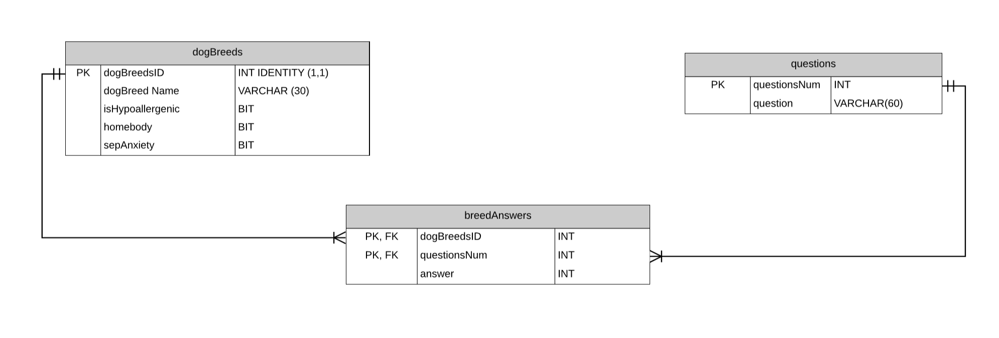

<h2 class="code-line" data-line-start=66 data-line-end=67 >Algorithm</h2>

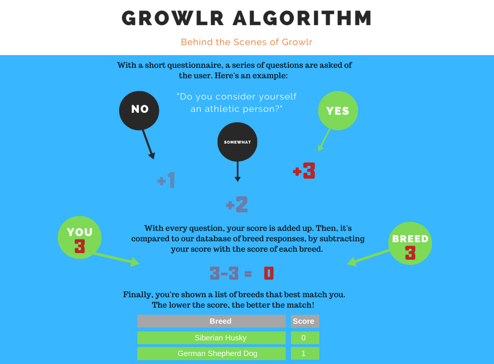

In addition to this algorithm, Growlr also uses the Petfinder API’s filtering queries. If you have children, cats or dog, Growlr will only show you adoptable dogs that are recorded as being good with children, cats or dogs.

<h2 class="code-line" data-line-start=72 data-line-end=73 >How the Data Moves</h2>

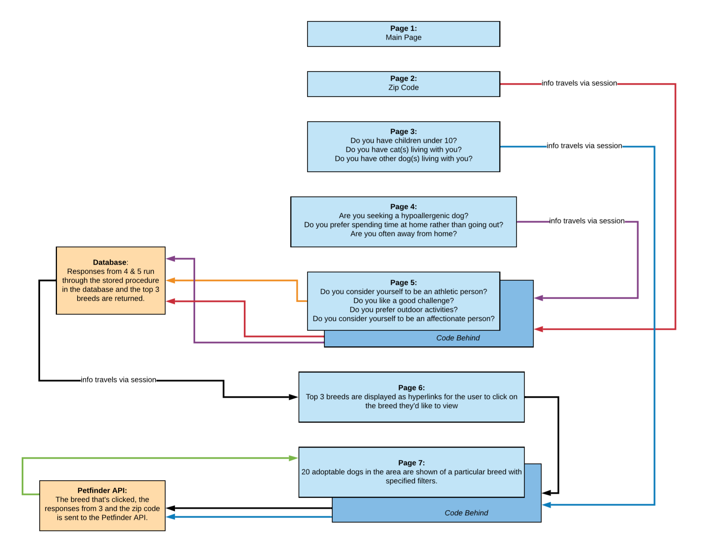

<h2 class="code-line" data-line-start=76 data-line-end=77 >Connecting to Growlr</h2>
<ol>
<li class="has-line-data" data-line-start="78" data-line-end="79">Copy and Paste the contents of the <a href="https://github.com/cynthiasidlauskas/Growlr/blob/master/GrowlrDatabaseFinal.txt" title="GrowlrDatabaseFinal.txt">GrowlrDatabaseFinal.txt</a> file to your Microsoft SQL Server Management Studio.</li>
<li class="has-line-data" data-line-start="79" data-line-end="80">Execute the data.</li>
<li class="has-line-data" data-line-start="80" data-line-end="81">In properties, Copy the connection string.</li>
<li class="has-line-data" data-line-start="81" data-line-end="82">Download everything that has the  “Final Project Commit ---- Need Database to operate” comment and open in Visual Studio or your favorite code editor.</li>
<li class="has-line-data" data-line-start="82" data-line-end="84">Paste your connection string into the Web.Config file, in the appropriate place within the connectionString angular brackets.</li>
</ol>
<h2 class="code-line" data-line-start=84 data-line-end=85 >Video Demo</h2>

Click this <a href="https://photos.app.goo.gl/C935FMfwwiMZ8u9Z6">link</a> to view a view a video demonstration of Growlr!

